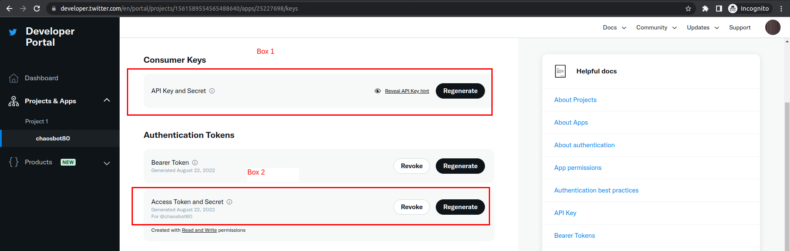

# twitter_fractal_bot

Posts images of fractals to twitter at https://twitter.com/chaosbot80


## How to make your own bot with this code

Create a .env file with contents like this

```
API_KEY="xxxxxxxxxxxxxxxxxxxxxxxxx"
API_SECRET="yyyyyyyyyyyyyyyyyyyyyyyyyyyyyyyyyyyyyyyyyyyyyyyyyy"
ACCESS_TOKEN="aaaaaaaaaaaaaaaaaaa-bbbbbbbbbbbbbbbbbbbbbbbbbbbbbb"
ACCESS_TOKEN_SECRET="ccccccccccccccccccccccccccccccccccccccccccccc"
```

Note 1: The format of the ACCESS_TOKEN as
aaaaaaaaaaaaaaaaaaa-bbbbbbbbbbbbbbbbbbbbbbbbbbbbbb is just how it's given to
you, it's not two different things

Note 2: The API key is sometimes referred to as "consumer key" in other
(older) twitter API references.



Figure showing where to get the API key+API secret (box 1) and access token+access secret (box 2)

## Usage

Run `yarn post` to make a new post to twitter with a random Figure

Run `yarn gen` to just make a new random image

## Other

My first twitter bot!
